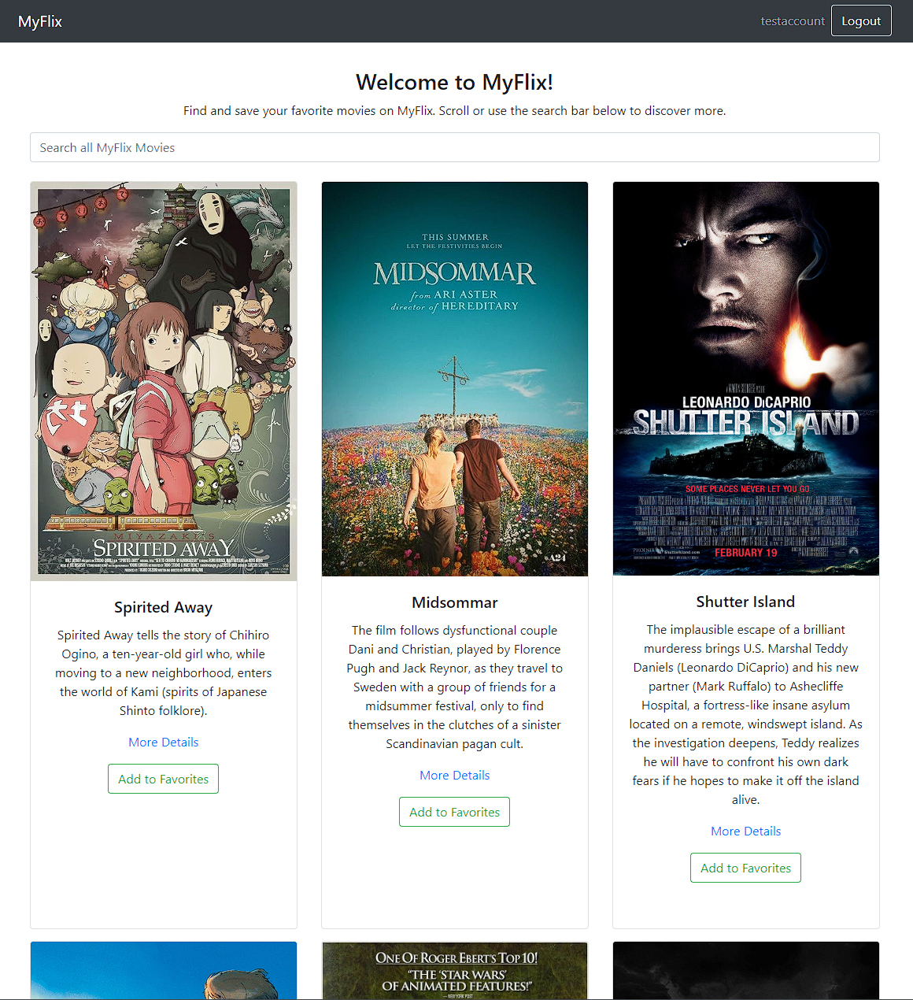
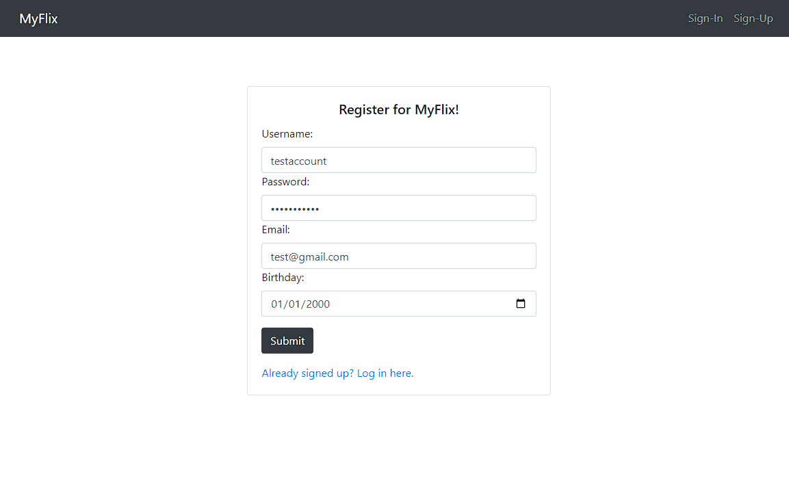
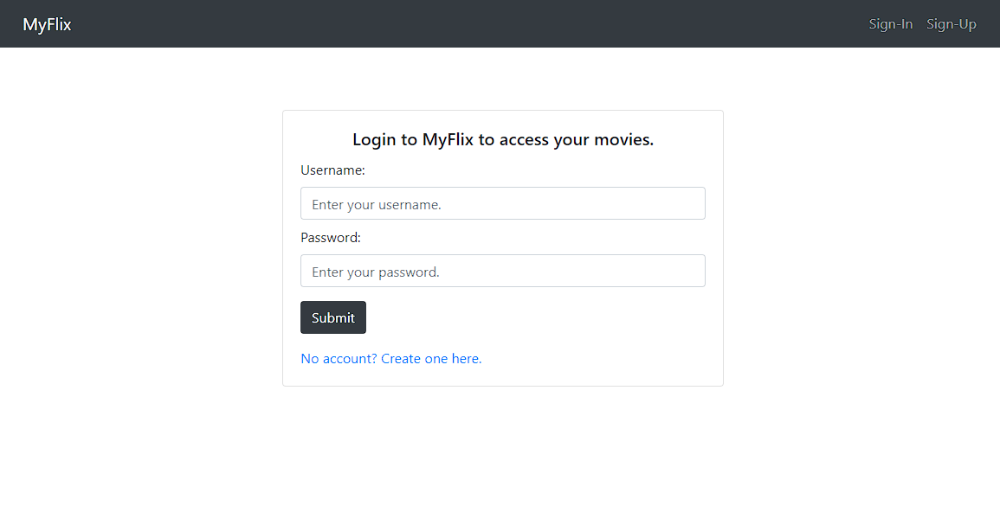
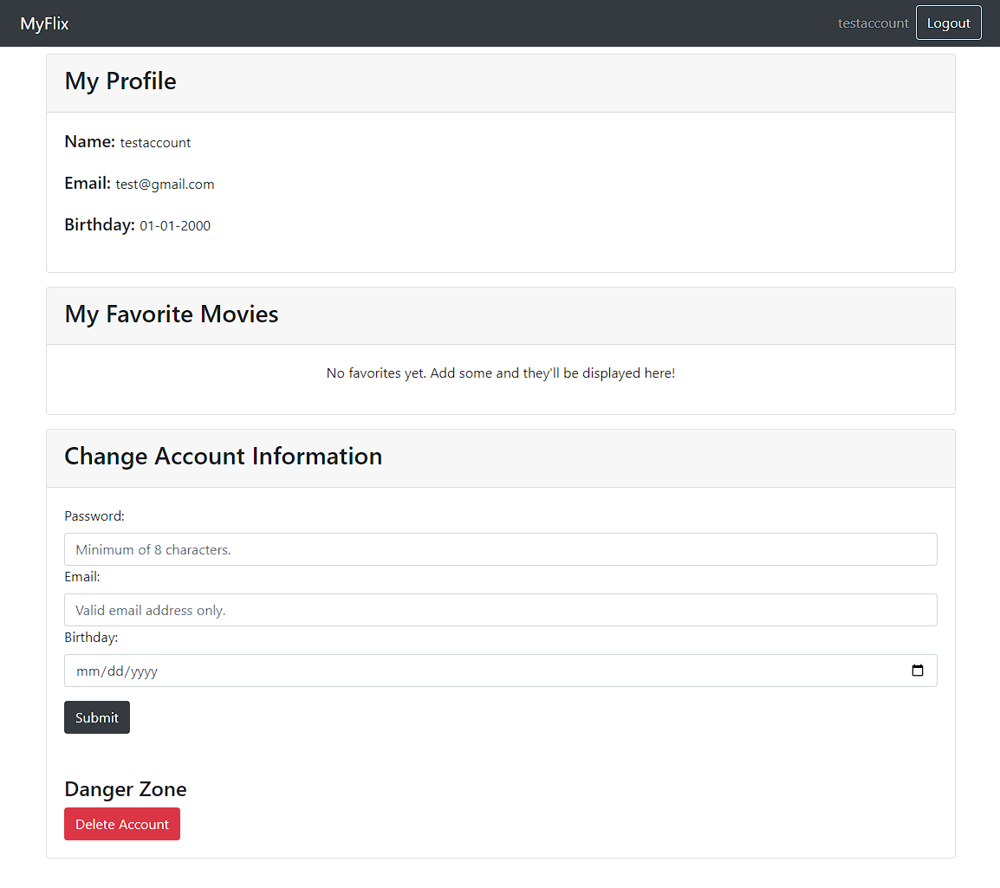

# myFlix Client

### About:
The client-side component of a "movies" web application.
Allows users to access a database with information on movies, genres, and directors.
Users can sign up, update/change their account information, and manage a list of favorite movies.

Visit the website here:  
https://myflix17507.netlify.app/

Main Page:   

Login Screen:  

Login Screen:  

Profile Page:  

### Languages/Libraries/Frameworks used:   
JavaScript  
SCSS    
React    
Bootstrap   
Parcel  

